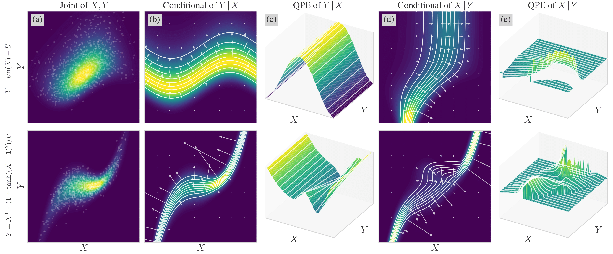

# Causal Discovery via Quantile Partial Effect

```bibtex
@misc{qpe_cd_2025,
    title={Causal Discovery via Quantile Partial Effect}, 
    author={Yikang Chen and Xingzhe Sun and Dehui Du},
    year={2025},
    eprint={2509.12981},
    archivePrefix={arXiv},
    primaryClass={cs.LG},
    url={https://arxiv.org/abs/2509.12981}, 
}
```



### Dataset

> **Dataset** can be downloaded from https://drive.google.com/file/d/1MyyLeoGhKHq80l80fTxldiSVI5K7RsHs.<br> Unzip to the root directory of this repo. A `data` subdirectory is expected to be created.

### Requirements

> **Full requirements**: `numpy`, `torch`, `scikit-learn`, `causal-learn`, `matplotlib`. (Latest versions are acceptable)

### Requirements

> **Examples** are available in the `examples` subdirectory.

### QPE-k (Kernel-based QPE with Least Square Basis Test)

QPE-k is an algorithm for bivariate causal discovery.

```python
import numpy
from qpek import qpe_k

qpe_12, score_12, qpe_21, score_21 = qpe_k(
    x1=x1, # NDArray shaped (n, 1)
    x1=x2, # NDArray shaped (n, 1)
    basis_funcs=[
        lambda y: numpy.ones_like(y),
        lambda y: y,
        lambda y: y**3,
        lambda y: numpy.tanh(y),
    ],
)
is_x1_to_x2 = score_12 > score_21
```

> Requirements: `numpy`.

To reproduce results, run:

```shell
python -m reproduce.run_qpek
```

### QPE-f (Flow-based QPE with Neural Basis Test)

QPE-f is an algorithm for bivariate causal discovery.

```python
import torch
from qpef import qpe_f, UMNNConditionalTransform, FixedBasisNeuralQPE

qpe_12, score_12, qpe_21, score_21 = qpe_f(
    x1=x1, # NDArray shaped (n, 1)
    x1=x2, # NDArray shaped (n, 1)
    transform_cls=UMNNConditionalTransform,
    transforms=1,
    neural_qpe_cls=FixedBasisNeuralQPE,
    neural_qpe_kwargs={
        'basis_funcs': [
            lambda y: torch.ones_like(y),
            lambda y: y,
        ],
    },
)
is_x1_to_x2 = score_12 > score_21
```

> Requirements: `numpy`, `torch`, `zuko`.

To reproduce results, run:

```shell
python -m reproduce.run_qpef_hyper # hyper QPE
python -m reproduce.run_qpef_hyper # lowrank QPE
python -m reproduce.run_qpef_poly # constant QPE
python -m reproduce.run_qpef_fixed # affine QPE
```

we only provide some basic results, while you can modify these scripts for hyperparameter tuning.

### QPE Visualization

```python
from visualize import *

fig = plt.figure(figsize=(24, 8.5))
gs = fig.add_gridspec(1, 5, width_ratios=[1, 1, 1, 1, 1])

ax1 = fig.add_subplot(gs[0, 0])
visualize_scatter(axes[0][0], x, y) # scatter plot
ax2 = fig.add_subplot(gs[0, 1])
visualize_density(axes[0][1], x, y) # density plot
ax3 = fig.add_subplot(gs[0, 2], projection='3d')
visualize_qpe_scatter(axes[0][2], qpe_12, x, y) # QPE scatter plot
ax4 = fig.add_subplot(gs[0, 3], projection='3d')
visualize_qpe_surface(axes[0][3], qpe_12) # QPE surface plot
ax5 = fig.add_subplot(gs[0, 4], projection='3d')
visualize_qpe_intersection_y(axes[0][4], qpe_12) # QPE Y-intersection plot
```

### FICO (Fisher Information Causal Ordering)

FICO is an algorithm for multivariate causal ordering.

```python
from fico import fico
order = fico(
    X=X, # NDArray shaped (n, d)
    eta_G=0.001,
)
order, graph = fico(
    X=X, # NDArray shaped (n, d)
    eta_G=0.001,
    alpha=0.05,
    return_graph=True,
)
```

> Requirements: `numpy`, `scikit-learn`, `causal-learn`.

To reproduce results, run:

```shell
python -m reproduce.run_fico
```